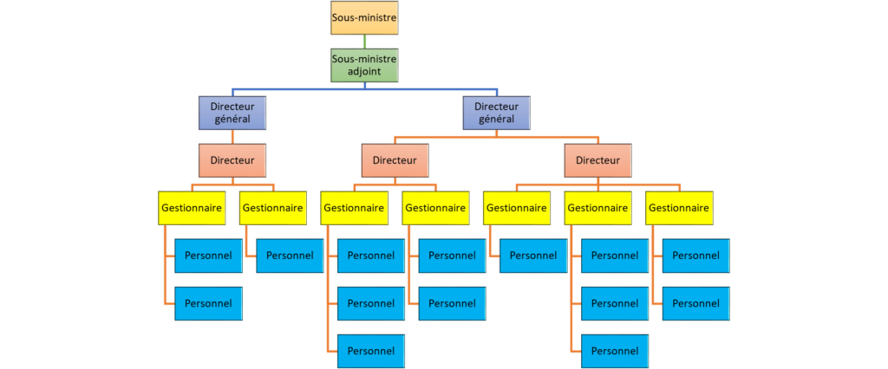

**Systems Thinking**

When considering the forces impacting our change we want to focus as much as possible on the system as a whole, understanding that everything is interconnected. When we do so we are better-positioned to take advantage of positive synergies that we could amplify, and avoid unexpected negative downstream effects, risks and other challenges, both for our own change and for other components of the organization. Systems Thinking helps us deal with complexity.

**_\*Note_****:** _Using models such as the 5-Ws,_ _McKinsey’s 7-S, and Weisbord’s 6 box model, can be a great starting point for Systems Thinking. Also of interest, the_ [_Adaptive Action methodology_](https://www.hsdinstitute.org/resources/adaptive-action.html#:~:text=Adaptive%20Action%20is%20an%20iterative,identify%20your%20next%20wise%20action.) _by Human Systems Dynamics provides different tools that can help us navigate complex, continually shifting systems._

According to Systems Thinking theory, all parts of the system are in some way connected and an action in one area can have a ripple effect. While change can occur within a system, there are forces that stimulate change (called reinforcing feedback loops) and forces (called balancing feedback loops) that tend to bring that system back to some level of equilibrium close to the status quo we are aiming to change.

We may need to use both of these feedback loops in our change effort, but for a major transformation we will often need to overcome the balancing feedback loops. We can think of our organization as more like an ecosystem, rather than an organizational chart.

**Our organization through a Systems Thinking lens**

_Copyright_ [_istockphoto.com_]

**Our organization through a traditional lens**

  
  

When analyzing our “feedback” we want to consider both across the system (e.g., interdependencies across government functions) and over time (e.g., what is the history of change in this organization as it relates to …).

**_\*Note_**_: For more on Systems Thinking see Peter Senge’s work, including his book Fifth Discipline_.

**How can we better understand how our change fits into the broader context?**

**System mapping**

At this point we’ve done a deeper analysis on some of the supporting and hindering forces, including some of their characteristics and their likelihood and level of impact on our change. We can go a bit further than this using system mapping. This type of tool offers a visual interpretation of our various forces and can allow us to better recognize interdependencies in various parts of the system.

We can map our forces as feedback loops (both reinforcing and balancing). When we use loops, rather than a more linear approach, we can be more flexible and revisit earlier discussions and assumptions throughout the process. This approach is ideal in contexts where our change is iterative and each successive intervention builds on the previous one (e.g., in capacity-building).

For more information on how to do system mapping we can consult various online sources. For example, the Centre for the Evaluation of Complexity Across the Nexus’ offers a [Participatory Systems Mapping guide](https://www.cecan.ac.uk/wp-content/uploads/2020/09/PSM-Workshop-method.pdf) (English only) and a [How to Design a Participatory Systems Mapping process](https://www.cecan.ac.uk/wp-content/uploads/2022/03/How-to-design-a-PSM-process-Final.pdf) (English only, pages 3-8).

There is also a range of digital mapping software that can support this process. Among others, these include: [Loopy](https://ncase.me/loopy/), [Kumu](https://kumu.io/), [diagrams.net](https://www.diagrams.net/), [Netdraw](https://sites.google.com/site/netdrawsoftware/download) (most of these at least have a free trial, although payment is required for additional features).

Ultimately, what we are aiming for is a visual representation of the various factors that can impact (and in turn be impacted by) the change we are attempting to introduce. Working through this process with stakeholders is a key way to minimize unintended consequences and negative surprises or amplify positive synergies.

**Next steps**

With a better understanding of the system we are introducing a change into, we can look more closely at some of these important interdependencies.

* * *

[******Next: Understanding our interdependencies******](/framework-for-leading-change/understanding-our-interdependencies/)

[Back to beginning of section](/framework-for-leading-change/understanding-our-context/)

* * *
