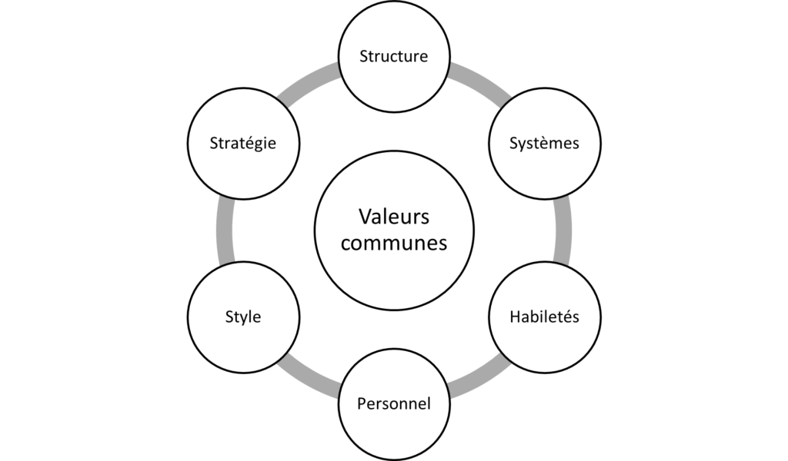

L’évaluation des répercussions de notre changement sur les différents secteurs de l’organisation nous aidera à mieux comprendre les domaines où le changement pourrait nécessiter un soutien et où nous pourrions faire face à des obstacles.

En fin de compte, nous voulons tirer parti du travail que nous avons accompli avec nos intervenants tout au long du processus (p. ex. d’après nos discussions sur les interdépendances). Nous gagnons également à adopter une perspective globale de l’organisation pour nous aider à reconnaître les occasions à saisir et à réduire le risque d’écarts ou de surprises.

**Comment pouvons-nous évaluer l’incidence de notre changement?**

Il existe un certain nombre d’outils que nous pouvons utiliser pour évaluer l’incidence du changement sur le plan organisationnel (p. ex. l’évaluation de l’incidence sur l’organisation de Prosci, le modèle d’action adaptative de Human Systems Dynamics, le cadre des 7 « S » de McKinsey). Chacun de ces éléments offre une perspective différente sur l’organisation. Quelle que soit l’approche que nous adoptons, l’idée est d’effectuer l’évaluation la plus globale possible de l’incidence de notre changement afin de maximiser les possibilités et de réduire au minimum les surprises en tenant compte des interdépendances.

Une façon d’évaluer l’incidence sur l’organisation est d’utiliser le [cadre des 7 « S » de McKinsey](https://www.mckinsey.com/business-functions/strategy-and-corporate-finance/our-insights/enduring-ideas-the-7-s-framework) (en anglais seulement). Les sept catégories en question, qui commencent toutes par un « s » en anglais, sont les suivantes :

- Stratégie – notre planification et nos objectifs à long terme;

- Structure – organigramme de l’organisation, p. ex. liens hiérarchiques;

- Systèmes – processus officiels et officieux qui régissent nos activités quotidiennes;

- Habiletés – capacités et compétences;

- Valeurs communes – culture de travail, systèmes de croyances;

- Personnel – nos employés;

- Style – notre approche en matière de leadership.

Chacun de ces éléments est interconnecté plutôt que linéaire et hiérarchique.

_Le mettre sur papier_

La bonne nouvelle est que notre mobilisation constante et approfondie auprès des intervenants nous a probablement déjà fourni les données quantitatives et qualitatives dont nous avons besoin pour effectuer notre analyse (voir les sections suivantes : Développer notre argumentaire en faveur du changement; Définir notre vision de l’avenir; Définir nos conditions de réussite; Analyser notre environnement : moteurs et obstacles; Déterminer où s’inscrit notre changement; Comprendre nos interdépendances; Saturation au changement et fatigue liée au changement; Évaluer dans quelle mesure nous sommes prêts à mettre en œuvre le changement).

Ici, nous cherchons principalement à comprendre où nous en sommes aujourd’hui, quelles sont les lacunes, quelles mesures nous pourrions devoir prendre et quelle incidence cela pourrait avoir sur les 7 catégories du modèle.

Il est à noter que le cadre des 7 « S » de McKinsey est un cadre parmi plusieurs autres (pour en savoir davantage  sur la façon d’utiliser ce modèle, consultez la page connexe sur le [site Web de McKinsey](https://www.mckinsey.com/business-functions/strategy-and-corporate-finance/our-insights/enduring-ideas-the-7-s-framework) (en anglais seulement). Quelle que soit l’approche que nous utilisons, il nous est utile d’obtenir ce point de vue global de l’organisation et de ses interdépendances, de cerner les perspectives (ou catégories) que nous souhaitons utiliser pour examiner l’organisation, et de mener notre évaluation des incidences en nous fondant sur nos discussions avec les intervenants.

**Prochaines étapes**

Maintenant que nous comprenons mieux les incidences du changement sur notre organisation, nous pouvons en analyser les incidences sur nos intervenants.

* * *

[****Prochain : **Évaluation de l’incidence sur les intervenants******](/evaluation-de-lincidence-sur-les-intervenants/)

[**Retour au début de la section**](/capacite-etat-de-preparation-et-incidence/)

* * *
