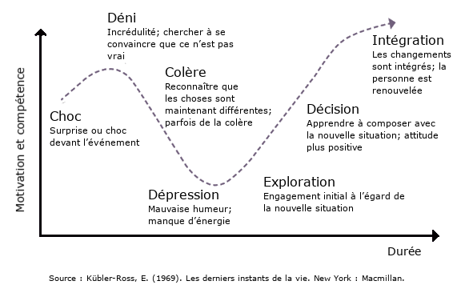

**Que pouvons-nous faire une fois notre changement annoncé?**

En appliquant une mentalité de leadership en matière de changement, nous pouvons adopter un certain nombre de comportements et d’activités pour accroître les chances de réussite de notre changement. Par exemple, il est souvent utile de faire ce qui suit :

- **Déployer une présence accrue** dans notre milieu de travail, discuter avec les gens (aborder les tensions plutôt que de chercher à les éviter)

- **Mobiliser continuellement les gens** au sujet de l’environnement actuel de la fonction publique et pour connaître leurs pensées sur l’éventail des incidences potentielles du changement

- **Inviter courageusement la discussion sur des sujets difficiles**, car cela augmentera la confiance et réduira la crainte et l’incertitude

- **Relier les gens à certaines des tendances de changement au sein de la fonction publique**, soit des changements qui surviennent de toute façon, malgré nos préférences ou nos préoccupations. Par exemple :
    
    - La nécessité pour tous les organismes de la fonction publique d’être plus efficientsLa nécessité de se concentrer sur la recherche de solutions pour lutter contre les changements climatiquesLa nécessité de moderniser la prestation des services
    
    - Le nouveau paysage technologique et culturel (p. ex. le virage croissant vers les services numériques qui a été accéléré par la COVID-19)

- **Renforcer certaines des valeurs d’ordre supérieur** qui font de l’organisation ce qu’elle est pour la fonction publique et la population canadienne

- **Aider les gens à se souvenir** des changements importants qu’ils ont apportés avec succès par le passé et de ce qui leur a permis de réussir

- **Indiquer clairement ce qui ne changera pas**, afin que les gens aient davantage de certitude, puissent maintenir un point d’ancrage et mieux comprendre ce qui change réellement

- **Garder à l’esprit notre compréhension du système et de ses interdépendances** alors que noustraversons le changement (pour en savoir plus à ce sujet, se reporter à la section 3 : Comprendre notre contexte : Déterminer où s’inscrit notre changement : Pensée systémique)

- **Aborder le changement sous l’angle de la croissance**, en le voyant comme une occasion de croître et d’expérimenter sur le plan professionnel (pour en savoir plus à ce sujet, lire Carol Dweck)

La mise en œuvre d’une approche du leadership du changement et l’adoption des mentalités connexes peuvent nous aider à demeurer conscients des divers éléments de notre changement. Un autre aspect clé consiste à aider les autres à faire de même.

**Comment encourager nos leaders à soutenir la mise en œuvre?**

Bien que nous ayons renforcé la capacité des gestionnaires et des superviseurs en matière de leadership du changement, il est bon de rappeler aux gestionnaires un certain nombre de choses pour les encourager à participer pleinement et positivement au changement.

Le changement (ou « transition », selon la définition de William Bridges) est le travail, souvent difficile sur le plan émotionnel, que les gens doivent opérer à l’intérieur d’eux‑mêmes pour évoluer avec le changement. Nous traversons tous les différentes étapes de la transition à différents moments et à différentes vitesses.

En nous fondant sur les travaux de la psychiatre Elisabeth Kubler-Ross (_Les derniers instants de la vie_ \[1969\]_)_, nous pouvons considérer cette transition interne comme une sorte de période de deuil. Les différentes personnes peuvent ou non connaître toutes les étapes de cette transition (voir ci-dessous) et les vivre à différents degrés d’intensité. Cela dit, le fait de mieux connaître ces étapes peut nous aider à comprendre pourquoi les gens appuient ou non le changement.

Les étapes de la transition sont les suivantes :

1. Choc

3. Déni

5. Colère

7. Dépression

9. Exploration

11. Décision

13. Intégration

**La courbe du changement**

La courbe de changement au fil du temps dans un graphique linéaire. Une ligne et une flèche à l’extrême gauche indique le moral et la compétence. Une ligne en bas indique le temps. Il y a une flèche pointillée montrant les sommets et les creux du moral et de la compétence au fil du temps que nous avançons à travers un changement.

_Tiré de_ [_Leading Effective Change: A Primer for the HR Professional_](https://www.researchgate.net/publication/345819452_Leading_Effective_Change_A_Primer_for_the_HR_Professional) _(en anglais seulement), de John Austin_

Le leadership joue un rôle clé dans la reconnaissance et la prise de conscience de ces phases par le personnel, en comprenant et en validant les pertes réelles que vivent les gens lorsqu’un changement est proposé, et en aidant généralement les employés tout au long de la transition. Une bonne ressource sur les transitions est le livre _Manager les transitions_ de William Bridges.

Voici certaines des façons dont nous pouvons appuyer cette transition (adapté de _Manager les transitions,_ William Bridges_)_ :

- Préciser qui perd quoi – selon la complexité du changement, nous pourrions ajouter une colonne à notre liste d’intervenants pour indiquer, s’il y a lieu, ce qu’ils perdent ou gagnent en raison du changement

- Accepter la réalité et l’importance des pertes subjectives

- Prévoir toute « réaction excessive » au lieu d’en être surpris

- Reconnaître les pertes ouvertement et avec compassion

- Anticiper et accepter le fait que les gens traversent ces phases de transition

- Compenser les gens pour leurs pertes

- Définir ce qui est fini et ce qui ne l’est pas

- Marquer la fin des choses qui ont changé

- Traiter le passé avec respect

- Laissez les gens emporter un fragment du passé avec eux

- Montrer comment ce qui se termine assure la continuité de ce qui compte vraiment

Ultimement, nous voulons être conscients du fait que les gens traverseront une période de transition, à différentes vitesses. L’utilisation de ces connaissances peut nous aider à mieux guider les gens à travers le changement et à obtenir de meilleurs résultats. Pour y arriver, les gestionnaires peuvent notamment se montrer constamment disponibles et ouverts envers les employés lorsqu’ils ont besoin de discuter.

**Adoption du changement**

<img src="images/FLC-Change-adoption-curve-FR-1024x565.png"

La courbe d’adoption du changement. Comprend le niveau d’effort/d’engagement sur l’axe y. Indique le temps le long de l’axe x. Les points de la courbe d’adoption du changement sont les suivants : Contact (communiquer / informer) Sensibilisation (communiquer/impliquer) Compréhension (compréhension des besoins / formation) Acceptation (où le changement de comportement commence) Adoption individuelle (soutien/encadrement, rétroaction/renforcement) Institutionnalisation (mesure, rétroaction, internalisation) Le long de l’axe des X, il y a les conséquences de ne pas comprendre/s’adapter à la courbe d’adoption du changement. Il s’agit notamment du manque de sensibilisation, de la confusion, du déni/de la perception négative, de la décision de ne pas appuyer, du succès mitigé et de la récidive.

Adapté de Connor Partners (formerly ODR Inc.)

La courbe d’adoption montre la progression des niveaux d’adoption du changement (les éléments en bleu, juste au-dessus de la courbe), y compris certaines des activités nécessaires pour soutenir les gens dans cette progression (au-dessus de chacun des éléments en bleu). Les conséquences indiquées au bas du graphique montrent les réactions possibles lorsque ces activités ne sont pas menées ou sont mal exécutées.

Ici, un élément clé concerne la position de l’étoile, qui marque le premier signal de l’acceptation. Une erreur courante consiste à supposer que, parce qu’il y a une certaine adoption ou un changement des comportements dès cette étape précoce, le changement est prêt à prendre racine. En fait, à cette étape, nous approchons plutôt d’un point crucial où, si nous ne donnons pas suite à nos actions de manière durable, notre changement sera probablement voué à l’échec.

Nous continuerons de devoir amener le plus de personnes et de groupes possible à adopter le changement dans le but de l’institutionnaliser après nos activités de pérennité  et nos efforts de consolidation (voir [la section 6 – Élaborer nos plans : Plan de consolidation/pérennité](/framework-for-leading-change/plan-de-consolidation-perennite/)).

**Prochaines étapes**

Au fur et à mesure que nous progressons dans la mise en œuvre du changement, nous pouvons rajuster nos mécanismes de rétroaction afin de nous assurer d’avoir le plus conscience possible des divers éléments de notre changement.

Cela s’inscrit dans la promotion du dialogue, qui nous aidera à prendre le pouls de la situation et à rajuster nos plans et nos mesures au besoin. C’est ce que nous allons faire dans la prochaine section

* * *

[****Prochain : Établir des mécanismes de rétroaction et mesurer les progrès****](/framework-for-leading-change/etablir-des-mecanismes-de-retroaction-et-mesurer-les-progres/)

[**Retour au début de la section**](/framework-for-leading-change/mise-en-oeuvre-du-changement/)

* * *
