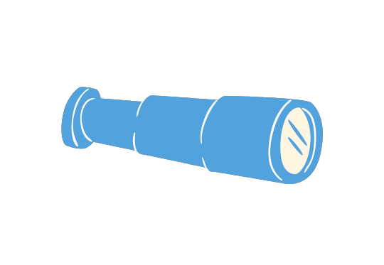

The field of change has grown significantly over the past several decades through industry, government, and academic research and experience. While there are now many methodologies to pull from, we have gained a greater understanding of the importance of leadership characteristics and mindsets in introducing and leading sustainable change.

This section will help us develop mindsets primed for leading change (both for ourselves and others involved in the change). It will also provide an overview of some concepts we can use to effectively plan and implement our change initiative. It is not meant to be cumbersome nor exhaustive, but more to give us a foundation we can use to build our integrated change strategy and plan.

Here we will:

- [Determine the type of change we’re leading so that we identify the best approach to support it](/framework-for-leading-change/the-type-of-change-were-leading/)

- [Gain an understanding of how to apply both change management and change leadership](/framework-for-leading-change/change-management-and-change-leadership/)

- [Improve our understanding of change models and methodologies](/framework-for-leading-change/change-models-and-methodologies/)

- [Learn how to lead change in government](/framework-for-leading-change/leading-change-in-government/)

- [Better understand change roles](/framework-for-leading-change/change-roles/)

- [Identify your governance for the change](/framework-for-leading-change/governance-for-change/)

- [Learn how to lead change in a virtual work environment](/framework-for-leading-change/leading-change-in-a-virtual-hybrid-environment/)

- [Build trust among the leadership team and staff](/framework-for-leading-change/building-trust-and-modelling-behaviour/)

- [Begin fostering productive dialogue about the change](/framework-for-leading-change/fostering-a-dialogue/)

* * *

[Next: **Determine the type of change we're leading**](/framework-for-leading-change/the-type-of-change-were-leading/)

[Back to beginning of framework](/framework-for-leading-change/)

* * *
