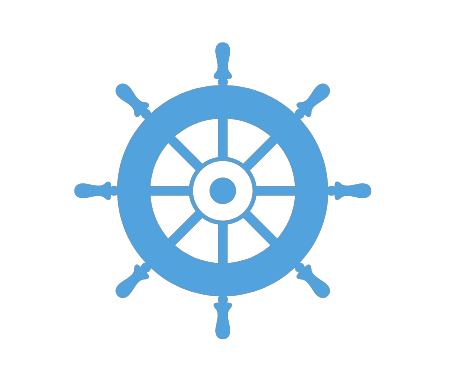

<head>
        
        
        
        
        
        
        

    <nav class="navbar">
        <ul class="nav-list">
            <li><a href="/framework-for-leading-change/naviguer-dans-le-monde-du-changement/">Naviguer à travers le monde du changement</a></li>
            <li><a href="/framework-for-leading-change/jeter-les-bases-dun-changement-reussi/">Jeter les bases d’un changement réussi</a></li>
            <li><a href="/framework-for-leading-change/comprendre-notre-contexte/">Comprendre notre contexte</a></li>
            <li><a href="/framework-for-leading-change/mise-en-oeuvre-nos-activites-de-changement/">Naviguer à travers notre changement</a></li>
            <li><a href="/framework-for-leading-change/atteindre-notre-point-de-cheminement/">Atteindre notre point de cheminement</a></li>
            <li><a href="/framework-for-leading-change/contactez-nous/">Contact</a></li>
        </ul>
        
    </nav>
 
<a href="https://change-leadership.github.io/framework-for-leading-change/index">English</a>
 

</head>

 

       
Ce cadre est conçu pour renforcer notre capacité à diriger différents types de changement à l’échelle de la fonction publique, allant des changements progressifs aux changements transformationnels. Il est axé sur une approche souple pouvant s’adapter en fonction du contexte, et introduit des concepts et des méthodes qui nous guideront dans la planification et la mise en œuvre de nos activités. L’utilisation de ce cadre pour diriger le changement peut accroître les chances de réussite d’une initiative, et tracer un chemin pour tirer parti de nos réussites afin de soutenir le changement futur.

En partant du principe selon lequel aucune méthode de changement ne permet, à elle seule, de résoudre tous les défis, ce cadre applique un éventail de modèles selon le contexte. Il intègre notamment les principales phases des pratiques exemplaires reconnues pour diriger le changement.

Le cadre est divisé en quatre parties, lesquelles s’inspirent du modèle « en amont – à mi-chemin  – en aval » souvent utilisé pour [cerner les déterminants sociaux de la santé](https://www.rand.org/content/dam/rand/pubs/working_papers/WR1000/WR1096/RAND_WR1096.pdf) (lien en anglais seulement).

* * *

## **Utiliser le cadre**

Conceptuellement, nous pouvons nous considérer comme des explorateurs qui naviguent à travers des eaux partiellement balisées vers un avenir incertain. Cette analogie peut nous aider à élargir notre compréhension du changement lui-même et de ce qui sera nécessaire pour atteindre notre point de cheminement.

Le cadre est donc composé de quatre parties, lesquelles regroupent huit sections. Pour nous faire une idée générale du processus dans son ensemble, ce qui suit fournit un aperçu de ces sections et de la place qu’elles occupent au sein des  quatre parties du cadre. Il convient de noter que même si le processus est établi selon un chemin précis, il arrive que nous devions remanier certains aspects de certaines sections.

Dans le cadre d’un processus de direction du changement, il arrive souvent que l’on doive revenir aux sections précédentes, ce qui ne devrait pas être considéré comme un recul.

* * *

Approfondir notre **compréhension** de la façon de naviguer à travers le changement

**1.** [**Naviguer à travers le monde du changement**](/framework-for-leading-change/naviguer-dans-le-monde-du-changement/) permet  de recueillir des concepts essentiels qui nous aideront à élaborer notre stratégie et à mettre en œuvre notre plan.

**2.** [Jeter les bases d’un changement réussi](/framework-for-leading-change/jeter-les-bases-dun-changement-reussi/) permet de définir le « pourquoi » du changement, les conditions à remplir pour la réussite du projet, et les façons dont nous pouvons concrétiser le changement voulu. À cette étape, nous préparons le terrain pour l’élaboration de notre stratégie de navigation en vue du changement à apporter.

### Elle nous aide également à garder quelques points à l’esprit

Notre connaissance de la façon de naviguer (c’est-à-dire, dans ce cas-ci, notre connaissance des méthodes, des techniques et des concepts les plus récents en matière de changement) est essentielle pour déterminer l’efficacité de notre planification et de nos étapes de navigation. Ne pas connaître les principes fondamentaux de la navigation, c’est risquer d’aboutir à un tout autre endroit que ce qui était voulu.

* * *

Établir des ******stratégies****** et ******planifier****** notre itinéraire

**3.** [Comprendre notre contexte](/framework-for-leading-change/comprendre-notre-contexte/) consiste à évaluer notre environnement et notre culture, à la fois pour déterminer où s’inscrit notre changement dans l’ensemble de l’organisation et pour déterminer la meilleure approche afin de soutenir ce changement.

**4.** [La capacité, l’état de préparation et l’incidence](/framework-for-leading-change/capacite-etat-de-preparation-et-incidence/) nous donnent l’occasion de renforcer la compréhension de notre préparation à l’égard du changement, de l’incidence qu’il aura sur les principaux intervenants, et de la façon dont nous travaillerons avec eux tout au long du changement.

**5.** [Rallier les gens au changement](/framework-for-leading-change/rallier-les-gens-au-changement/) comprend les activités de mobilisation nécessaires pour assurer la réussite du changement, selon le type de changement que nous dirigeons et les personnes qui y participent.

**6.** [Élaborer nos plans](/framework-for-leading-change/elaborer-nos-plans/) implique la création et l’intégration des différents plans (p. ex. mobilisation et communications) qui orienteront notre mise en œuvre du changement.

### Elle nous aide également à garder quelques points à l’esprit

La planification est une étape fondamentale de l’exploration, mais nous devons être prêts à toutes les éventualités et savoir comment s’adapter  en cas d’obstacle. Au cours de ce voyage, nous aurons presque inévitablement à composer avec des situations inattendues, comme le navigateur devant un arbre tombé qui obstrue un cours d’eau. Telle est la nature imprévisible du changement. Cependant, une compréhension approfondie de la façon de naviguer nous permettra de déterminer s’il est préférable d’effectuer un pivot, de changer de cap, de rebrousser chemin ou même d’abandonner le voyage (si cela est absolument nécessaire).

* * *

******Naviguer****** à travers notre changement

**7.** [La mise en œuvre du changement](/framework-for-leading-change/mettre-en-oeuvre-nos-activites-de-changement/) implique la réalisation des activités élaborées dans les premières sections, y compris faire preuve de souplesse, solliciter des commentaires et s’adapter au fur et à mesure.

### Elle nous aide également à garder quelques points à l’esprit

Une mobilisation et une collaboration approfondies sont essentielles à l’atteinte de notre point de cheminement. Il nous sera seulement possible d’atteindre notre but que si toutes les personnes concernées conviennent de la destination et participent au voyage.

* * *

Atteindre notre ****point de cheminement****

**8.** [Vivre avec le changement](/framework-for-leading-change/atteindre-notre-point-de-cheminement/) consiste à s’assurer que le changement est durable et que les résultats positifs pourront servir de levier pour aider l’organisation à aborder les futurs changements.

### Elle nous aide également à garder quelques points à l’esprit

Bien que notre objectif soit d’atteindre le point de cheminement, ce point ne marque pas la fin de notre parcours. En tant qu’explorateurs, nous voudrons éventuellement atteindre de nouvelles destinations. En effet, une fois ce point atteint, il est possible que nous tombions à court de provisions, que des prédateurs s’installent dans la région, ou que nous apercevions au loin de nouvelles terres plus fertiles. Peu importe la raison, le travail que nous accomplissons lors de cette étape (comme la consolidation des leçons apprises) contribuera à faciliter le voyage des prochains explorateurs et à nous faciliter la tâche pour la prochaine partie de notre périple.

* * *

[Quel devrait être le point de départ de ce cadre?](/framework-for-leading-change/quel-devrait-etre-le-point-de-depart-de-ce-cadre/)

[Débuter](/framework-for-leading-change/naviguer-dans-le-monde-du-changement/)

* * *
