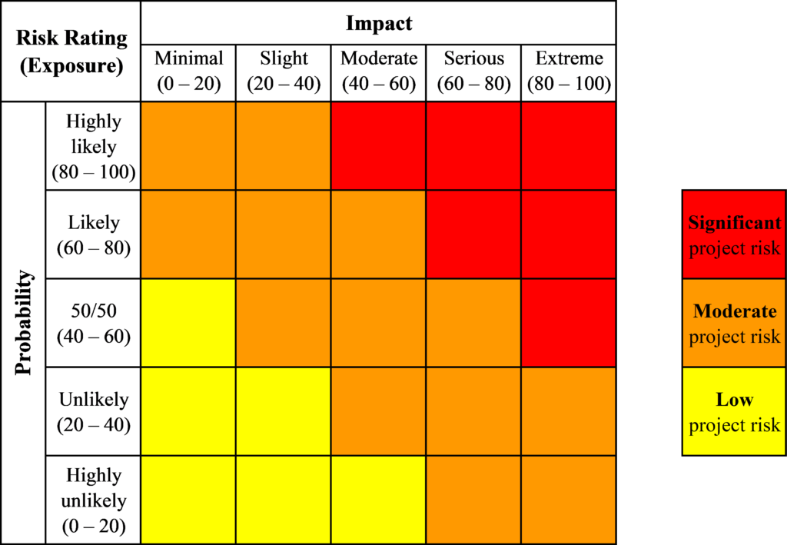

Risks are the uncertainty and possible obstacles that surround future events and outcomes in relation to a project. It is the likelihood and impact of an event with the potential to influence the progress and results of the change. Identifying and evaluating risks is an important part of the change process.

**How can we identify and evaluate our risks?**

If we’ve undergone some or all of the steps in sections 3 (Understanding our context) and 4 (Capacity and readiness) we likely already have a good sense of our environment. We’ve asked senior leadership and other key stakeholders about their expectations and concerns and gained the qualitative and quantitative data we need to analyze our risks effectively.

We can start by circling back to questions we discussed with stakeholders earlier in the process (especially in Analyzing our environment, Determining our interdependencies, and Analyzing our stakeholders).

Some of the risk categories we may want to focus on, include:

- **Environment** (this can relate to the impact of large scale projects that may affect our change, such as the government-wide spending reviews)

- **Legal** (this can be matters before the court, newly introduced legislation, privacy issues)

- **Governance** (this includes leadership support for the change and resource allocation)

- **Change** (this relates to the extent of the change required on the stakeholders’ part, buy-in, change fatigue and others)

- **Stakeholders** (often centering on how to lead change with a diverse and numerous array of stakeholders)

- **Technology** (including new systems and their expected impacts)

- **Performance** (this could include impacts on performance based on the emergence of an undesired outcome like expected efficiencies not being realized)

- **Budget** (this is about the possibility of insufficient funding or funds are unavailable, and also includes the possibility that there are unexpected governmental budget cuts causing a need to slow down progress)

With a sense of what our risks are we can divide them into internal (those we have control/influence over) and external (those we do no have full control over).

We can then determine the exposure (which is the product of the probability and the impact). This is based on:

- Its probability of occurrence from the moment of the assessment onward – on a scale of 0 (Highly unlikely) to 100 (Highly likely)

- Its impact, or the severity of the consequences to the project or the organization should the risk occur – on a scale of 0 (Highly unlikely) to 100 (Highly likely)

Below is an example of how we might chart our risks visually.

**_\*Note_**: _Some risks may have a low probability of occurrence but a serious impact to the project should they occur. For this reason we may need to use our judgement to put them in a category that helps us keep them on our radar._

We can then assess each risk with the following criteria:

- Its **frequency of occurrence** on a scale of 1 (Low) to 5 (High). In other words, the number of times it might happen throughout the duration of the project. In some cases, the risk may only occur at a certain point in time or at a phase such as the roll-out

- Its **relative importance** when compared with the other risks within the same category. On a scale of 1 (Low) to 5 (High)

- The **timeframe** in which the risk can reasonably materialize (“short term–within a year,” “mid term–from 1 to 2 years” or “long term–2 years or more”). Again, some risks may materialize only in certain phases of the project. For this reason, the timeframe given depends on the moment of the assessment

- The **s****takeholders’ aversion** or **intolerance** to that risk (Low, Medium, High). It is the degree of resistance or discomfort that may result, for some stakeholders, from having to deal with the risk, should it materialize

- The **l****evel of priority** (Low, Medium, High). The priority we give to the risk in relation to stakeholders’ aversion.

We can then think about our response to each risk. These can consist of:

- **Avoidance**: eliminating the risk, usually by eliminating the cause

- **Transference**: transferring the risk to another organization or part of an organization (**_\*Note:_** responsibility may revert to the first party if the second party is not able to deal with the risk)

- **Mitigation**: reducing either the probability of a risk occurrence, its impact, or both

- **Acceptance**: occurring when there is minimal control over a risk. (e.g., a political change outside the organization). The acceptance can be **active** (e.g., by developing a contingency plan to implement) or **passive** (e.g., by accepting the consequences).

We can develop a chart to monitor our risks.

![example of a risk chart.

Includes the following categories, Status (with suggestions of critical / priority / watch),
Category (with suggestions of environment, legal, governance, change, stakeholders, technology, performance, budget
Risks (list and define),
Rating (probability times impact - significant / moderate / low),
Frequency of occurrence (from 1 to 5), Relative importance (by comparison to other risks, from 1 to 5) ,
Time-frame (short / medium / long / ongoing),
Stakeholder aversion / intolerance (high / medium / low),
Level of priority (high / medium / low),
Risk response (avoid / transfer / mitigate / accept),
Residual risk,
and contingency actions Monitoring OPI / Actions response OPI](images/Risks-chart-1024x366.png)

Risks are likely to shift over time. It’s important that we revisit them throughout the process and assign individuals or groups to monitor particular risks.

**Next steps**

At this point we have a deep understanding of our change, our stakeholders, and the various impacts and risks of our change. Now we can determine the levels of engagement we may need with various stakeholders and some of the corresponding activities we might want to conduct to improve our chance of success.

* * *

[Next: Getting people on board](/getting-people-on-board/)

[Back to beginning of section](/capacity-readiness-and-impact/)

* * *
